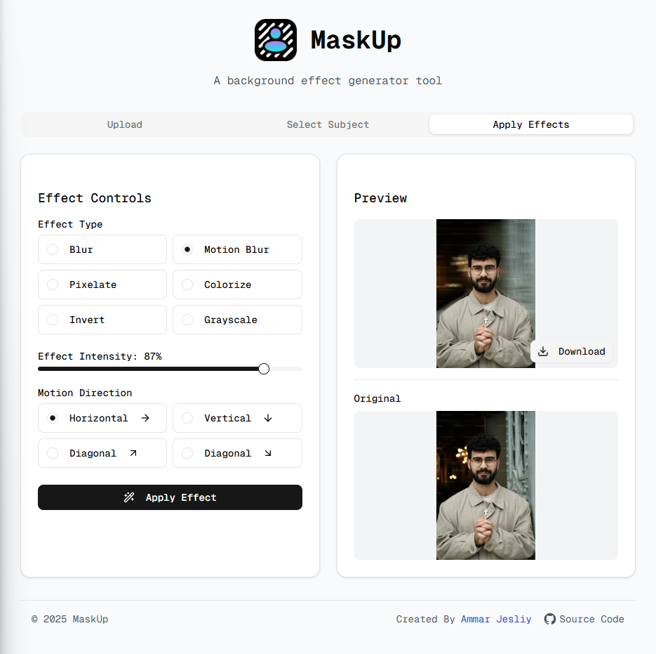

# MaskUp

[](https://opensource.org/licenses/MIT)

A simple to use AI-powered web application that applies background effects to images while preserving the main subject using advanced image segmentation.



## 🎯 About

MaskUp uses AI image segmentation to identify and isolate the main subject in your photos. It then applies various effects only to the background, creating professional-looking results with just a few clicks.

## 🚀 Features

- **AI Subject Detection**: Automatically identifies people and objects in images
- **Background Effects**: Apply various effects to image backgrounds:
  - Motion blur
  - Gaussian blur
  - Greyscale
  - Solid color backgrounds
- **Subject Preservation**: Keeps the main subject clear and unmodified
- **Easy-to-use Interface**: Simple upload, process, and download workflow
- **Mobile-friendly**: Responsive design works on all devices

## 🛠️ Technologies

- [Next.js](https://nextjs.org/) - React framework for production
- [TypeScript](https://www.typescriptlang.org/) - Type-safe JavaScript
- [TensorFlow.js](https://www.tensorflow.org/js) - Machine learning framework
- [BodyPix](https://github.com/tensorflow/tfjs-models/tree/master/body-pix) - Person segmentation model
- [Tailwind CSS](https://tailwindcss.com/) - Utility-first CSS framework
- [Vercel](https://vercel.com/) - Deployment platform

## 📋 Prerequisites

- Node.js 18.x or later
- npm, yarn, pnpm, or bun package manager
- Modern web browser with WebGL support

## 💻 Installation

1. Clone the repository:

   ```bash
   git clone https://github.com/ammar-jesliy/mask-up.git
   cd mask-up
   ```

2. Install dependencies:
   ```bash
   npm install
   # or
   yarn install
   # or
   pnpm install
   # or
   bun install
   ```

## 🚀 Usage

Run the development server:

```bash
npm run dev
# or
yarn dev
# or
pnpm dev
# or
bun dev
```

Open [http://localhost:3000](http://localhost:3000) with your browser to see the application.

### How to Use:

1. Upload an image using the file picker
2. Manually select the subject or wait for AI to detect and segment the subject
3. Choose a background effect from the options menu
4. Adjust settings if needed
5. Download or share your edited image

## 🤝 Contributing

Contributions are welcome! Please feel free to submit a Pull Request.

1. Fork the repository
2. Create your feature branch (`git checkout -b feature/amazing-feature`)
3. Commit your changes (`git commit -m 'Add some amazing feature'`)
4. Push to the branch (`git push origin feature/amazing-feature`)
5. Open a Pull Request

## 📝 License

This project is licensed under the MIT License - see the [LICENSE](LICENSE) file for details.

## 🙏 Acknowledgments

- [TensorFlow.js](https://www.tensorflow.org/js) for the ML framework
- [BodyPix](https://github.com/tensorflow/tfjs-models/tree/master/body-pix) project for segmentation models
- [Next.js](https://nextjs.org) for the amazing framework
